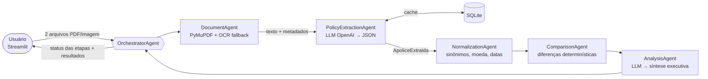

# PolicyMind D&O — Comparador Inteligente de Apólices

> Projeto Final · Curso InsurMinds / I2A2 — Plataforma Inteligente para Análise e Comparação de Apólices D&O

O PolicyMind D&O é um MVP acadêmico que lê apólices de seguro D&O (Responsabilidade Civil de Administradores) em PDF ou imagem, extrai as informações relevantes com **IA generativa**, padroniza os termos entre seguradoras diferentes, compara duas apólices e gera uma **síntese executiva** com ganhos, perdas e pontos de atenção.

A solução usa uma **arquitetura multiagente**: cinco agentes especializados, coordenados por um **OrchestratorAgent**.

> ⚖️ **Aviso:** solução acadêmica. A análise não constitui recomendação de contratação e não substitui a avaliação de corretor de seguros, da seguradora ou parecer jurídico.

---

## Caso de demonstração

Duas apólices reais da mesma empresa, em períodos consecutivos (renovação com troca de seguradora):

| | Apólice A | Apólice B |
|---|---|---|
| Seguradora | Tokio Marine | AXA (renovação de outra seguradora) |
| Segurado | Sumitomo Indústrias Pesadas do Brasil Ltda. | Sumitomo Indústrias Pesadas do Brasil Ltda. |
| Vigência | 30/09/2024 a 30/09/2025 | 30/09/2025 a 30/09/2026 |
| Prêmio total | R$ 10.880,98 | R$ 5.571,59 |
| Franquia | não identificada (especificações anexas não incluídas no arquivo) | "Não há aplicação de franquia" |

Também há Condições Gerais da **AXA**, da **Allianz** e da **Porto Seguro** para testes, e uma página escaneada (imagem) da Allianz 2017 para demonstrar o OCR. Veja [`data/README.md`](data/README.md).

---

## Arquitetura



| Agente | Responsabilidade | Usa IA generativa? |
|---|---|---|
| **DocumentAgent** | Recebe PDF/imagem, extrai o texto nativo e aplica OCR (Tesseract) só nas páginas sem texto | Não |
| **PolicyExtractionAgent** | Extrai o JSON padronizado da apólice, com evidência (página e trecho) de cada campo | **Sim** (OpenAI) |
| **NormalizationAgent** | Padroniza seguradoras, valores (R$ → número), datas (ISO) e sinônimos de coberturas | Não (dicionário) |
| **ComparisonAgent** | Compara campo a campo e item a item: igual, alterado, adicionado, removido, mantido | Não (determinístico) |
| **AnalysisAgent** | Redige a síntese executiva com ganhos, perdas e pontos de atenção | **Sim** (OpenAI) |
| **OrchestratorAgent** | Coordena o fluxo, registra o status/duração de cada etapa e trata erros | Não |

Os detalhes estão no [Relatório Técnico](docs/relatorio_tecnico.md) (versão PDF em [`Projeto_Final_Artefatos/`](Projeto_Final_Artefatos/)). O Pitch Deck está em `Projeto_Final_Artefatos/`. O vídeo está disponível por link do Google Drive, documentado no [README dessa pasta](Projeto_Final_Artefatos/README.md).

---

## Tecnologias

Python 3.12+ · Streamlit · PyMuPDF · Tesseract OCR (pytesseract) · API compatível com OpenAI (validado com **Groq · openai/gpt-oss-120b**; também funciona com OpenAI e Grok) · Pydantic v2 · Pandas · SQLite · Pytest · python-dotenv

Não usamos LangChain, CrewAI ou similares: os agentes são classes Python explícitas, pequenas e testáveis.

---

## Instalação

### 1. Pré-requisitos

- Python **3.12 ou superior**
- (Opcional, só para imagens/PDFs escaneados) **Tesseract OCR** com o idioma português:
  - Windows: instalador em <https://github.com/UB-Mannheim/tesseract/wiki>. Marque o idioma "Portuguese" e adicione `C:\Program Files\Tesseract-OCR` ao `PATH`.
  - Ubuntu/Debian: `sudo apt install tesseract-ocr tesseract-ocr-por`
  - macOS: `brew install tesseract tesseract-lang`

### 2. Clonar e instalar dependências

```bash
git clone https://github.com/<usuario>/<repositorio>.git
cd <repositorio>
python -m venv .venv
# Windows:  .venv\Scripts\activate
# Linux/Mac: source .venv/bin/activate
pip install -r requirements.txt
```

### 3. Configurar a OPENAI_API_KEY

```bash
# Windows (PowerShell)
copy .env.example .env
# Linux/Mac
cp .env.example .env
```

Abra o arquivo `.env` e preencha:

```env
OPENAI_API_KEY=sk-...sua-chave...
OPENAI_MODEL=gpt-4o-mini
```

**Usando o Groq (configuração validada no projeto, plano gratuito):** crie a chave em <https://console.groq.com>.

```env
OPENAI_API_KEY=gsk_...sua-chave...
OPENAI_MODEL=openai/gpt-oss-120b
OPENAI_BASE_URL=https://api.groq.com/openai/v1
MAX_CHARS_LLM=16000
```

`MAX_CHARS_LLM=16000` mantém cada pedido abaixo do limite de 8.000 tokens por minuto do plano gratuito.

**Usando o Grok (xAI) ou outro provedor compatível com a API da OpenAI:**

```env
OPENAI_API_KEY=xai-...sua-chave...
OPENAI_MODEL=<modelo listado em console.x.ai>
OPENAI_BASE_URL=https://api.x.ai/v1
```

O arquivo `.env` está no `.gitignore` e **nunca** deve ser commitado. Nenhuma chave fica no código.

> Sem chave, a aplicação continua funcionando em modo **"regras (SEM IA)"**: extrai apenas os campos básicos por expressões regulares e **avisa claramente** que a IA generativa não foi usada. Para desativar esse modo, use `ALLOW_RULE_FALLBACK=false`.

---

## Execução

```bash
streamlit run app.py
```

Acesse <http://localhost:8501>. Depois:

1. Envie duas apólices (A = anterior/referência, B = renovação/comparada), ou ative **"Usar arquivos da pasta data/"** na barra lateral.
2. Clique em **Analisar e comparar**.
3. Acompanhe as etapas dos agentes e explore as abas: Dados Gerais, Limites, Prêmio, Franquias, Coberturas, Extensões, Exclusões e Pontos de Atenção.
4. Abra **"JSON estruturado extraído"** para ver a saída de cada agente ou baixe o resultado completo.

### Testes

```bash
pytest -v
```

Os testes usam apólices **sintéticas** geradas em memória e um LLM simulado, por isso rodam sem chave de API e sem os documentos reais.

---

## Estrutura do repositório

```
app.py                      Interface Streamlit
src/
  config.py                 Configuração via variáveis de ambiente (.env)
  schemas.py                Contratos Pydantic entre os agentes
  llm_client.py             Cliente OpenAI (modo JSON, timeout, erros claros)
  storage.py                SQLite: cache e histórico de apólices extraídas
  text_utils.py             Moeda/datas pt-BR e verificação de evidências
  orchestrator.py           OrchestratorAgent
  agents/
    document_agent.py       DocumentAgent
    policy_extraction_agent.py  PolicyExtractionAgent (+ extrator por regras)
    normalization_agent.py  NormalizationAgent
    comparison_agent.py     ComparisonAgent
    analysis_agent.py       AnalysisAgent
tests/                      Testes Pytest (33 testes)
docs/relatorio_tecnico.md   Relatório técnico
data/                       Documentos de exemplo (apólices reais fora do Git)
Projeto_Final_Artefatos/    Pitch deck, vídeo e demais artefatos
```

---

## Limitações conhecidas (resumo)

- A apólice Tokio Marine disponível tem só o frontispício: LMG, franquia e coberturas não estão no arquivo e aparecem como **não identificados**.
- Documentos muito longos (Condições Gerais com mais de 100 páginas) são reduzidos às páginas mais relevantes antes de irem ao LLM.
- O dicionário de sinônimos cobre os termos mais comuns de D&O, não todos.
- O OCR depende da qualidade da digitalização.

A lista completa está no relatório técnico.

---

**Grupo:** Insight Builders

## Integrantes

- Márcio de la Cruz Lui
- Mauro José de Oliveira
- Pedro Antonio Franceschini

## Licença

Distribuído sob a licença **MIT**. Veja [`LICENSE`](LICENSE).
