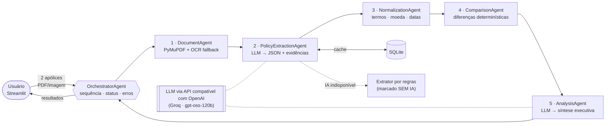
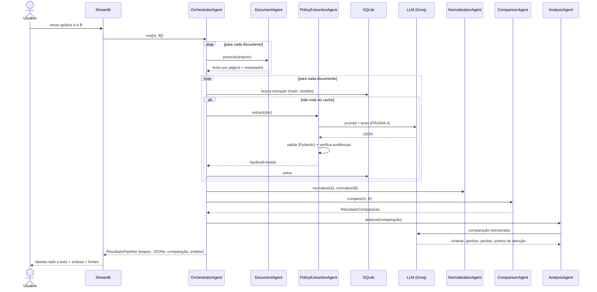

# Relatório Técnico — PolicyMind D&O

**Plataforma Inteligente para Análise e Comparação de Apólices D&O**
Projeto Final · Curso InsurMinds / I2A2 · Outubro de 2026

**Grupo:** Insight Builders

**Integrantes:** Márcio de la Cruz Lui · Mauro José de Oliveira · Pedro Antonio Franceschini

> Este projeto é acadêmico. As análises geradas não constituem recomendação de contratação e não substituem a avaliação de corretor de seguros, da seguradora ou parecer jurídico.

---

## 1. Problema

Apólices de seguro D&O são documentos longos (as Condições Gerais usadas neste projeto têm de 52 a 104 páginas), escritos em linguagem jurídica e com estruturas diferentes em cada seguradora. Para comparar uma renovação com a apólice anterior, um especialista precisa localizar e alinhar manualmente prêmios, limites, franquias, coberturas, extensões, exclusões e cláusulas particulares. Isso consome horas e está sujeito a erros.

O exemplo deste projeto mostra bem o problema. A Sumitomo Indústrias Pesadas do Brasil trocou a Tokio Marine (2024–2025) pela AXA (2025–2026), e o prêmio total caiu de R$ 10.880,98 para R$ 5.571,59. Avaliar o que mudou na proteção, além do preço, exige ler e comparar documentos com formatos totalmente diferentes.

## 2. Objetivo da solução

Construir um MVP que:

1. receba duas apólices em PDF ou imagem;
2. extraia o texto (de forma nativa ou por OCR);
3. use IA generativa para estruturar os dados num JSON padronizado, **sem inventar informações**;
4. padronize terminologias entre seguradoras;
5. compare as duas apólices de forma determinística e auditável;
6. gere uma síntese executiva com IA generativa;
7. apresente tudo numa interface simples, mostrando a **fonte** (página e trecho) de cada informação.

## 3. Fontes de dados

| Documento | Origem | Uso |
|---|---|---|
| Apólice Tokio Marine nº 100 0000053034 (2024–2025), 2 páginas | Documento real de cliente, cedido pelo grupo | Caso principal (A) |
| Apólice AXA nº 02852.2025.0001.0310.0006205 (2025–2026), 13 páginas | Documento real de cliente, cedido pelo grupo | Caso principal (B) |
| Condições Gerais AXA D&O — Processo SUSEP 15414.901016/2017-01 (versão 12/2025) | Publicação da seguradora / SUSEP | Testes e apoio |
| Condições Gerais Allianz D&O — Processo SUSEP 15414.901113/2017-96 (versão 12/2025) | Publicação da seguradora / SUSEP | Testes e apoio |
| Condições Gerais Porto Seguro D&O Capital Fechado — Processo SUSEP 15414.901349/2019-94 (02/2022) | Publicação da seguradora / SUSEP | Testes e apoio |
| Página 63 das Condições Gerais Allianz D&O de 28/12/2017 (imagem JPEG) | Publicação da seguradora | Demonstração de OCR |

Observação: a apólice AXA da Sumitomo cita o mesmo processo SUSEP (15414.901016/2017-01) das Condições Gerais AXA usadas nos testes. Isso permite relacionar a apólice ao seu produto.

As apólices reais não são publicadas no repositório (`.gitignore`), porque contêm dados de cliente (CNPJ, endereço, e-mail, corretor).

## 4. Arquitetura da solução

A solução usa uma **arquitetura multiagente**: cinco agentes especializados, cada um com uma única responsabilidade, coordenados por um **agente orquestrador**. Os agentes se comunicam por **contratos Pydantic** (`src/schemas.py`), o que torna as entradas e saídas explícitas e validadas.



### 4.1 Por que essa divisão?

- **Determinístico onde a precisão importa:** leitura, normalização e comparação não usam LLM. O mesmo par de documentos gera sempre a mesma comparação, que pode ser testada com Pytest.
- **IA generativa onde ela agrega valor:** (a) entender documentos com layouts e terminologias diferentes, que regras fixas não cobrem bem; (b) redigir uma análise em linguagem executiva.
- **Baixo acoplamento:** cada agente pode ser trocado sem afetar os outros. Por exemplo, a OpenAI pode virar um modelo local, ou o Tesseract pode ser substituído pelo AWS Textract.

## 5. Tecnologias utilizadas

| Tecnologia | Papel | Justificativa |
|---|---|---|
| Python 3.12+ | Linguagem | Ecossistema de IA e dados, visto no curso |
| Streamlit | Interface | Interface funcional em Python puro, ideal para demonstração |
| PyMuPDF | Leitura de PDF | Rápido e com reconstrução da ordem visual (`sort=True`), essencial para formulários tabulares como a apólice Tokio Marine |
| Tesseract (pytesseract) | OCR | Gratuito, local e com suporte a português; usado só como fallback |
| API compatível com OpenAI (provedor e modelo configuráveis) | IA generativa | Extração estruturada em modo JSON e redação da análise. Na validação usamos o **Groq** com o modelo **`openai/gpt-oss-120b`** (plano gratuito); OpenAI, Grok (xAI) ou outros provedores compatíveis funcionam trocando 3 variáveis no `.env` |
| Pydantic v2 | Schemas | Valida a saída do LLM e define os contratos entre agentes |
| Pandas | Tabelas | Montagem das tabelas comparativas da interface |
| SQLite | Armazenamento | Cache das extrações (evita custo repetido) e histórico consultável, sem servidor |
| Pytest | Testes | 33 testes automatizados |
| python-dotenv | Configuração | Credenciais fora do código (`.env`) |

**Frameworks de agentes (LangChain, CrewAI) não foram usados de propósito.** O fluxo é linear e conhecido, então um orquestrador explícito de cerca de 200 linhas é mais fácil de entender, depurar e apresentar do que uma camada de abstração adicional.

## 6. Descrição dos agentes

### 6.1 DocumentAgent (`src/agents/document_agent.py`)

- **Entrada:** nome do arquivo + bytes (PDF, JPG, PNG, TIFF).
- **Processo:** para cada página do PDF, extrai o texto nativo com PyMuPDF. Se a página tiver menos de 40 caracteres, ela é considerada digitalizada e vai para o OCR (Tesseract, idioma `por`). Imagens vão direto para o OCR. O texto passa por normalização Unicode NFKC, que desfaz ligaduras como "fi".
- **Saída:** `DocumentoProcessado`, com o texto por página, o método usado em cada uma (`texto`/`ocr`), o método geral (`texto`, `ocr`, `misto`), o hash SHA-256, o número de páginas e os avisos.
- **Erros tratados:** arquivo vazio, formato não suportado, PDF corrompido ou protegido por senha, falha de OCR.

O OCR é **fallback, não requisito**: todos os PDFs do caso principal têm texto nativo. O OCR só entra em páginas escaneadas e imagens (demonstrado com a página da Allianz 2017).

### 6.2 PolicyExtractionAgent (`src/agents/policy_extraction_agent.py`)

- **Entrada:** `DocumentoProcessado`.
- **Seleção de texto:** documentos acima de `MAX_CHARS_LLM` (120 mil caracteres por padrão; 16 mil no plano gratuito do Groq) são reduzidos em três passos:
  1. espaços usados só para alinhar colunas são compactados, o que economiza tokens sem perder informação;
  2. as três primeiras páginas (dados gerais e prêmio) e as páginas com dados críticos de especificação (LMG, franquia, tabelas "% do LMI") entram primeiro;
  3. as demais páginas entram por densidade de termos-chave (prêmio, franquia, LMI, exclusão etc.).
- **Prompt:** o texto vai com marcadores `[PÁGINA n]`, junto com regras rígidas:
  - usar só o texto fornecido;
  - campo ausente = `null`;
  - informar `texto_original`, `pagina` e `trecho` de cada valor;
  - não confundir "capital subscrito" da seguradora com LMG;
  - em Condições Gerais, deixar os campos contratuais nulos.
- **Saída:** `ApoliceExtraida`, com 20 campos escalares (seguradora, seguradora anterior, segurado, CNPJ, número, corretor, vigência inicial e final, prêmio líquido, IOF, prêmio total, LMG, LMI, franquia/POS, tipo de contratação, retroatividade, âmbito territorial, prazo complementar, processo SUSEP e tipo de documento), 4 listas (coberturas, extensões, exclusões, cláusulas relevantes) e observações.
- **Guardrail anti-alucinação:** depois da resposta do LLM, o agente confere se o `texto_original` ou o `trecho` de cada campo **existe de fato no documento**. Valores com números (R$, datas) exigem correspondência exata. Um valor sem evidência localizável é **descartado** (vira `null`) e gera um aviso.
- **Limite por minuto (HTTP 429):** o cliente de IA espera o tempo indicado pelo provedor e tenta de novo (até 2 vezes), em vez de abandonar a IA na primeira recusa.
- **Fallback sem IA:** se a OpenAI estiver indisponível e `ALLOW_RULE_FALLBACK=true`, um extrator por expressões regulares obtém os campos básicos e as tabelas "N% do LMI". O resultado é marcado como `metodo_extracao="regras"`, e a interface exibe **"Regras (SEM IA)"**.

### 6.3 NormalizationAgent (`src/agents/normalization_agent.py`)

- Converte valores monetários pt-BR para número ("R$ 10.880,98" → 10880.98) **sem arredondar**. Se o número informado pelo LLM divergir do texto original, prevalece o texto original, com aviso.
- Converte datas para ISO (30/09/2024 → 2024-09-30).
- Padroniza nomes de seguradoras ("TOKIO MARINE SEGURADORA S.A." → "Tokio Marine"), preservando o original em `texto_original`.
- Mapeia sinônimos para chaves canônicas, por meio de um dicionário de cerca de 40 conceitos de cobertura e 15 de exclusão. Exemplos:
  - "Bloqueio de Conta Corrente (Penhora On-Line)" → `penhora_bloqueio_contas`;
  - "Cobertura para Custos Emergenciais" e "Extensão de cobertura para despesas emergenciais" → `custos_emergenciais`.
- **Não cria nem infere** dados. Itens sem sinônimo conhecido mantêm o nome original como chave.

### 6.4 ComparisonAgent (`src/agents/comparison_agent.py`)

- **Campos escalares**, agrupados nas seções Dados Gerais, Prêmio, Limites e Franquias: `igual`, `alterado` (com variação percentual em valores), `somente_a`, `somente_b` ou `nao_identificado`.
- **Listas:** `mantido`, `alterado` (limite ou franquia diferentes), `adicionado` (só em B) ou `removido` (só em A).
- Coberturas, extensões e cláusulas particulares são comparadas num conjunto único, porque uma seguradora pode chamar de "extensão" o que outra chama de "cláusula particular".
- **Regra de honestidade:** se a lista não foi identificada em um dos documentos (caso da Tokio Marine, cujas especificações não estão no arquivo), os itens do outro documento recebem `sem_base_comparacao`, e **não** "adicionado". Da mesma forma, um limite ausente de um lado não é tratado como "alteração".

### 6.5 AnalysisAgent (`src/agents/analysis_agent.py`)

- Envia ao LLM **apenas a comparação estruturada** (não o documento), o que reduz custo e risco de alucinação.
- O prompt proíbe dizer que uma apólice é "melhor" ou "pior" juridicamente, exige citar os valores exatamente como recebidos e pede `sintese`, `ganhos`, `perdas` e `pontos_atencao`.
- Calcula também **destaques por regras**, que são fatos objetivos sem IA (troca de seguradora, variação de prêmio, campos ausentes, contagem de itens).
- A ressalva acadêmica é sempre anexada pelo código, e não pelo modelo.
- Se a IA falhar, `gerado_por_ia=false`, e a interface informa o erro e mostra só os destaques por regras.

### 6.6 OrchestratorAgent (`src/orchestrator.py`)

- Executa a sequência `Upload → DocumentAgent → PolicyExtractionAgent → NormalizationAgent → ComparisonAgent → AnalysisAgent → Interface`.
- Registra, para cada etapa, o status (`pendente`, `executando`, `sucesso`, `alerta`, `erro`), o horário, a duração e a mensagem, e notifica a interface em tempo real (callback `on_update`).
- **Política de erros:** qualquer exceção numa etapa vira status `erro`, o fluxo para de forma controlada e o resultado parcial volta para a interface. A aplicação não cai.
- **Política de IA:** primeiro consulta o cache SQLite (hash do arquivo + modelo), depois tenta o LLM e, por último, o fallback por regras, com status `alerta`.

## 7. Fluxo completo de processamento



## 8. Exemplo do JSON padronizado (trecho)

```json
{
  "seguradora": {"valor": "AXA", "texto_original": "AXA Seguros S.A.", "pagina": 1,
                 "trecho": "Seguradora: AXA Seguros S.A. Participação: 100%"},
  "premio_total": {"valor": 5571.59, "texto_original": "5.571,59", "pagina": 2,
                   "trecho": "Prêmio Total: R$ 5.571,59"},
  "lmg": {"valor": 5000000.0, "texto_original": "5.000.000,00", "pagina": 4,
          "trecho": "Limite máximo de garantia da Apólice: LMGA - R$ 5.000.000,00"},
  "lmi": {"valor": null, "texto_original": null, "pagina": null, "trecho": null},
  "franquia": {"valor": "Não há aplicação de franquia", "pagina": 7, "...": "..."},
  "extensoes": [
    {"nome": "Bloqueio de Conta Corrente (Penhora On-Line)",
     "nome_normalizado": "Bloqueio de contas / penhora on-line",
     "chave": "penhora_bloqueio_contas", "limite": "100% do LMI", "pagina": 5}
  ],
  "metodo_extracao": "llm",
  "modelo_llm": "openai/gpt-oss-120b"
}
```

## 9. Resultados obtidos

Execução de validação em 05/10/2026, no caso Sumitomo, com IA generativa: **Groq · `openai/gpt-oss-120b`** e `MAX_CHARS_LLM=16000`. Os **5 agentes concluíram com sucesso** e as duas apólices foram extraídas pela IA.

| Etapa | Status | Tempo |
|---|---|---|
| DocumentAgent | concluído | 0,8 s |
| PolicyExtractionAgent (2 apólices, IA) | concluído | 8,5 s |
| NormalizationAgent | concluído | < 0,1 s |
| ComparisonAgent | concluído | < 0,1 s |
| AnalysisAgent (IA) | concluído | 15,3 s (inclui espera pelo limite por minuto do plano gratuito) |

Principais dados comparados:

| Item | Tokio Marine 2024–2025 | AXA 2025–2026 | Status |
|---|---|---|---|
| Seguradora | Tokio Marine | AXA | alterado |
| Segurado / CNPJ | Sumitomo · 12.525.361/0001-30 | Sumitomo · 12.525.361/0001-30 | igual |
| Vigência | 30/09/2024 a 30/09/2025 | 30/09/2025 a 30/09/2026 | alterado |
| Prêmio líquido | R$ 10.133,16 | R$ 5.188,66 | −48,80% |
| Prêmio total | R$ 10.880,98 | R$ 5.571,59 | −48,80% |
| LMG | não identificado | R$ 5.000.000,00 | só em B |
| Franquia | não identificado | Não há aplicação de franquia | só em B |
| Coberturas/extensões/cláusulas | não identificadas (especificações anexas ausentes) | 2 coberturas, 18 extensões, 20 cláusulas | sem base de comparação |

A síntese executiva gerada pela IA (após as correções da seção 9.1) listou como ganhos **apenas** as reduções de prêmio líquido, IOF e prêmio total, que constam nas duas apólices. Ela declarou que não há informação sobre LMG e franquia na apólice A e que as coberturas e extensões da AXA não têm correspondência no documento da Tokio Marine, recomendando a verificação nos documentos originais.

Desempenho de leitura: os dois PDFs do caso principal são lidos em menos de 1 s. As Condições Gerais (52 a 104 páginas) são lidas em cerca de 2 s cada, e a página escaneada passa pelo OCR em cerca de 3 s.

Principal achado demonstrável: a ferramenta identifica de forma objetiva a **redução de 48,8% no prêmio** e, com o mesmo rigor, avisa que **não é possível concluir se houve perda ou ganho de cobertura**, porque o documento da Tokio Marine não traz as especificações. Esse é exatamente o tipo de ponto de atenção que um especialista precisaria validar.

### 9.1 Problemas encontrados na validação e como foram resolvidos

A validação com um provedor real expôs quatro problemas, todos corrigidos e cobertos por testes ou regras explícitas:

| Problema observado | Causa | Solução |
|---|---|---|
| Extração da apólice AXA caiu no modo "regras (SEM IA)" | Erro 413: o pedido tinha 8.189 tokens, e o plano gratuito do Groq permite 8.000 tokens por minuto | Compactação de espaços, priorização das páginas críticas e `MAX_CHARS_LLM=16000` |
| Página da franquia poderia ser cortada ao reduzir o documento | A relevância era medida por contagem absoluta de termos, favorecendo páginas de texto longo | Relevância por densidade de termos e prioridade para páginas com LMG, franquia e tabelas "% do LMI" |
| A IA listou o LMG e a franquia da AXA como "ganhos" | O dado não existe no documento da Tokio; não há como afirmar que houve inclusão | Regra no prompt: itens presentes em só um documento vão para "pontos de atenção", nunca para ganhos ou perdas |
| Valores como "R 10.880,98 para R" exibidos com fonte de fórmula | O Streamlit interpreta o texto entre dois "$" como LaTeX | Escape do caractere "$" nos textos gerados pela IA |

Esses ajustes reforçam o princípio central do projeto: **na dúvida, o sistema declara a ausência do dado em vez de concluir**.

## 10. Testes automatizados

O comando `pytest -v` executa **33 testes**, todos com documentos sintéticos e um LLM simulado:

| Arquivo | O que verifica |
|---|---|
| `test_document_agent.py` | Extração de texto de PDF; OCR acionado só em página sem texto; OCR real em imagem; formatos inválidos, arquivo vazio, PDF corrompido |
| `test_normalization_agent.py` | Conversão de moeda e data; seguradora canônica com original preservado; texto original prevalece em divergências; sinônimos; campos ausentes continuam nulos |
| `test_comparison_agent.py` | Status dos campos e variação percentual; listas (mantido, alterado, adicionado, removido); item em seções diferentes; "sem base de comparação" |
| `test_orchestrator.py` | Pipeline completo com IA; cliente OpenAI (erros e JSON inválido); guardrail descartando valor inventado; IA indisponível → regras + alerta (sem fingir IA); fallback desativado → erro sem derrubar; cache SQLite; campos ausentes |

## 11. Segurança e boas práticas

- Credenciais apenas em `.env` (fora do Git); `.env.example` documenta as variáveis.
- Apólices reais excluídas do repositório público via `.gitignore`.
- Mensagens de erro claras quando a OpenAI está indisponível; o sistema **nunca** apresenta o resultado por regras como se fosse IA.
- Código modular (um arquivo por agente), com tipagem e docstrings explicando a responsabilidade de cada componente.

## 12. Limitações conhecidas

1. **Documento incompleto:** a apólice Tokio Marine disponível tem só o frontispício (2 páginas). LMG, franquia e coberturas não podem ser comparados.
2. **Documentos longos e planos gratuitos:** só as páginas mais relevantes vão ao LLM, e alguma cláusula pode ficar de fora. No plano gratuito do Groq (8.000 tokens por minuto), o limite usado é de 16 mil caracteres: a apólice AXA envia as páginas 1 a 7 e 13 de 13, mas as Condições Gerais (52 a 104 páginas) ficam muito reduzidas. Um plano pago ou um modelo com mais capacidade resolve.
3. **Dicionário de sinônimos limitado:** cobre os conceitos D&O mais comuns. Termos novos são comparados pelo nome literal.
4. **Guardrail por correspondência textual:** pode descartar um valor correto se o LLM reformatar demais o trecho. Isso é seguro, mas gera falso negativo.
5. **OCR:** a qualidade depende da digitalização. O Tesseract não interpreta tabelas complexas tão bem quanto serviços como o Textract.
6. **Extrator por regras:** foi calibrado nos layouts de exemplo e serve apenas como contingência.
7. **Comparação de exclusões:** é feita por conceito (ex.: "atos dolosos") e não analisa a redação jurídica detalhada de cada cláusula.
8. **Custo e privacidade:** o texto do documento é enviado ao provedor de IA (Groq, na validação). Para dados sensíveis em produção, seria necessário avaliar contrato e LGPD, ou usar um modelo local.

## 13. Possibilidades de evolução

- **RAG sobre as Condições Gerais:** vincular cada apólice ao seu processo SUSEP e consultar a cláusula completa quando o usuário clicar num item.
- **Chat com as apólices** ("A AXA cobre multas?"), respondendo com citação de página.
- Comparação de **N apólices** (cotações de várias seguradoras) com ranking por critérios definidos pelo usuário.
- **Modelos locais** (Llama, Qwen via Ollama) para dados sensíveis.
- OCR em nuvem (AWS Textract / Azure Document Intelligence) para tabelas digitalizadas.
- Ampliação do dicionário de sinônimos com apoio do próprio LLM e validação humana.
- Avaliação quantitativa da extração (precisão e recall por campo) com um conjunto anotado.
- Exportação do relatório comparativo em PDF ou DOCX.
- API REST (FastAPI) e fila de processamento para lotes.

## 14. Conclusão

O PolicyMind D&O mostra como uma arquitetura multiagente simples, com um orquestrador explícito, combina componentes determinísticos (leitura, normalização, comparação) com IA generativa (extração e análise) para automatizar grande parte da comparação de apólices D&O. A solução privilegia **rastreabilidade** (fonte de cada dado), **honestidade** (campos ausentes ficam nulos, e a ausência de IA é declarada) e **clareza**, para que o fluxo possa ser explicado e auditado por quem vai usar o resultado.

---

*Análise gerada para fins acadêmicos (Projeto Final InsurMinds/I2A2). Não constitui recomendação de contratação e não substitui a avaliação de corretor de seguros, da seguradora ou parecer jurídico.*
